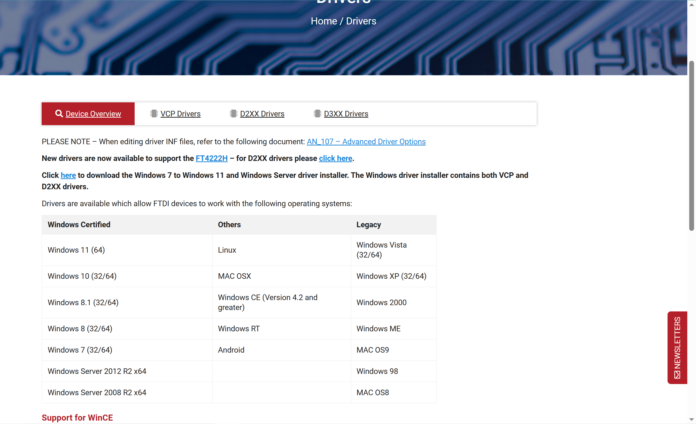

# 环境配置：

## arduino IDE：

- ### 安装：
  
  来到arduino官网，安装最新版：
  
  [Software | Arduino](https://www.arduino.cc/en/software)
  
  点击右侧第一行的windows，下载对应版本即可。
  
  安装跟装QQ一样简单。

- ### 配置：
  
  点击左上角”File-->Preference“：
  
  
  
  可以切换语言、主题、字体大小，记得勾上"Editor Quick Suggestions"才有联想功能。

## arduino驱动安装：

- 到官网下安装：
  
  [Drivers - FTDI (ftdichip.com)](https://ftdichip.com/drivers/)
  
  
  
  点击here，下载对应windows版本即可。
  安装跟装QQ一样简单。

## 库文件配置：

- ### IIC读取RGB信息：
  
  将“探索者”U盘中的：“Rino-js-N1DVD\爆破全地形参考资料\模块-传感器式-IIC颜色传感器\3.程序文件\库函数\MH_TCS34725.zip”复制到本地，在arduino IDE中点击“项目-->导入库-->添加.ZIP库“，选择该压缩包即可。
  
  在本项目下，已将该库拷贝到“libraries”中。

# 代码烧录

## 下载：

- 选择开发板为“arduino uno”，选择串口。

- 直接点击左上角上传按钮：“-->‘’

### 偶现问题：

- 偶尔出现光标挪到变量上没有显示相关信息的问题，可以重启IDE解决。

- 若上传失败，可以插拔端口重试，也可关闭“串口绘图仪”窗口并双击右上角“串口监视器”（可能是上次打开的串口还未关闭）。

# 代码上传云端：

## 创建账户：

- 打开arduino IDE，点击此处“登录”：
  
  
  
  来到arduino官网，用邮箱创建账户，很轻松。如果网一直卡可以考虑翻墙（非必要）。

## 创建云空间：

- 登录arduino云空间主页：
  
  [Arduino Cloud](https://cloud.arduino.cc/home/)
  
  登录后，点击：“Quick start-->New sketch”，进入页面。

## 上传本地项目：

- 点击“import”，跳出弹窗：
  
  
  
  大致意思就是，必须上传一个压缩包，压缩包里必须有一个名为libraries的文件夹，里面是第三方库（可以直接空掉）。除此之外，代码全部是.ino文件（不能放在文件夹里）。例如：
  
  
  
  即可上传至云端。可以右键工程重命名，方便版本管理。
  
  建议每次命名都用“作者+上传年月日”的格式，有助于团队协作。

## 分享项目：

- 右键项目，点击“share sketch”，选择“public”，复制link，其他人即可使用该网址访问此项目。